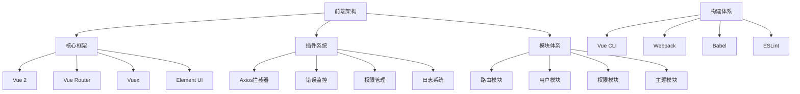
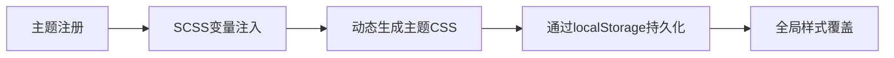

# D2-Admin 系统架构设计文档

## 技术架构图


## 目录结构规范
```
src/
├── api/            # API接口层
│   └── sys/        # 系统管理接口
├── assets/         # 静态资源
│   └── style/      # 样式体系
│       ├── theme/  # 主题系统（5套预设）
│       └── unit/   # 样式工具类
├── components/     # 全局组件
│   ├── d2-container # 页面容器组件
│   └── d2-icon     # 图标组件
├── layout/         # 布局体系
│   └── header-aside # 主布局模板
├── pages/          # 页面组件
│   ├── sys/        # 系统管理模块
│   └── demo/       # 功能演示模块
├── router/         # 路由配置
│   ├── modules/    # 路由模块
│   └── routes.js   # 路由入口
├── store/          # 状态管理
│   └── modules/    # Vuex模块
└── plugin/         # 插件系统
    ├── axios/      # 请求拦截
    └── error/      # 错误处理
```

## 核心模块设计

### 动态路由系统
1. 路由注册流程：
   ```mermaid
   sequenceDiagram
       用户登录->>+Mock服务: 获取权限路由
       Mock服务-->>-前端: 返回路由配置
       前端->>+路由守卫: 动态注册路由
       路由守卫->>权限模块: 校验访问权限
       权限模块-->>-路由守卫: 返回校验结果
       路由守卫->>路由实例: addRoutes()
   ```

2. 权限控制策略：
   - 路由元信息标记权限码
   - 全局前置守卫校验用户角色
   - 自动过滤未授权路由

### 主题切换系统


## 技术规范
1. 组件开发原则：
   - 容器组件：/components/d2-container
   - 业务组件：/pages/*/components
   - 全局组件需注册到/src/components/index.js

2. API调用规范：
```javascript
// 采用分层结构
import { login } from '@/api/sys/login'

export default {
  methods: {
    async handleLogin() {
      try {
        await login(this.form)
      } catch (error) {
        this.$notify.error(error)
      }
    }
  }
}
```

## 扩展性设计
1. 插件开发接口：
```javascript
// 在/src/plugin/目录下创建插件
export default {
  install(Vue, options) {
    Vue.prototype.$customMethod = () => {...}
  }
}
```

2. 主题扩展方法：
- 在/src/assets/style/theme/创建新主题目录
- 实现主题变量文件（variables.scss）
- 在theme.scss中注册新主题